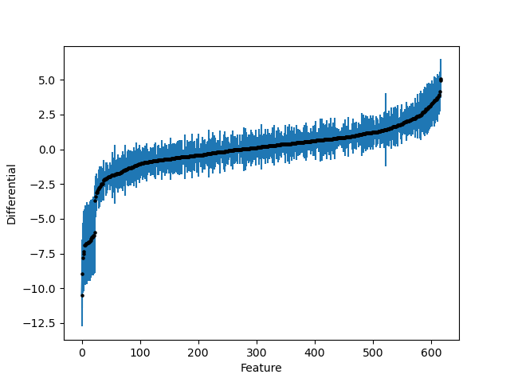

Implementing a default model
============================

BIRDMAn comes with several default models that you can use to fit your data. Here we will use the `Negative Binomial <https://en.wikipedia.org/wiki/Negative_binomial_distribution>`_ model as it is fairly common for `overdispersed count data <https://esajournals.onlinelibrary.wiley.com/doi/full/10.1890/10-1831.1>`_.

First, we will download a fairly simple dataset from Qiita. Qiita is an open-source platform for depositing and analyzing microbiome data. We will be using data from the study "Responses of gut microbiota to diet composition and weight loss in lean and obese mice" (Qiita ID: 107).

We can download the feature table and metadata with the following commands:

.. code-block:: bash

    wget -O data.zip "https://qiita.ucsd.edu/public_artifact_download/?artifact_id=44773"
    wget -O metadata.zip "https://qiita.ucsd.edu/public_download/?data=sample_information&study_id=107"
    unzip data.zip
    unzip metadata.zip

Next, we want to import the data into Python so we can run BIRDMAn.

.. code-block:: python

    import biom
    import pandas as pd

    from birdman import NegativeBinomial

    table = biom.load_table("BIOM/44773/otu_table.biom")
    metadata = pd.read_csv(
        "templates/107_20180101-113755.txt",
        sep="\t",
        index_col=0
    )

This table has nearly 2000 features, many of which are likely lowly prevalent. We are going to filter to only features that are present in at least 5 samples.

.. code-block:: python

    prevalence = table.to_dataframe().clip(upper=1).sum(axis=1)
    features_to_keep = prevalence[prevalence >= 5].index.tolist()
    table_filt = table.filter(features_to_keep, axis="observation")

This reduces the number of features from nearly 2000 to just over 600 - much more manageable!

For this example we're going to use a simple formula that only takes ``diet`` into account. For more information on formulas and design matrices see Jamie Morton's `blogpost <http://mortonjt.blogspot.com/2018/05/encoding-design-matrices-in-patsy.html>`_ on the topic.

.. code-block:: python

    nb = NegativeBinomial(
        table=table_filt,
        formula="diet",
        metadata=metadata,
        num_iter=1000,
    )

We then have to compile and fit our model. This is very straightforward in BIRDMAn.

.. note::

    Fitting this model took approximately 25 minutes on my laptop.

.. code-block:: python

    nb.compile_model()
    nb.fit_model()

Now we have our parameter estimates which we can use in downstream analyses. Many of BIRDMAn's included analysis & visualization functions take an ``arviz.InferenceData`` object. We provide a simple method to convert your BIRDMAn fit into this data structure. Note that the included ``NegativeBinomial`` model performs ALR regression, meaning that the one of the features (the first) is used as a reference. As a result, the resulting inference will have 1 fewer microbe than were in the original table. We can "add the other microbe back" by converting to CLR coordinates. We provide an easy function to do this in the ``transform`` module.

.. code-block:: python

    from birdman.transform import posterior_alr_to_clr
    inference = nb.to_inference_object()
    inference.posterior = posterior_alr_to_clr(
        inference.posterior,
        alr_params=["beta_var"],  # the default NB model has only beta in ALR coordinates
        dim_replacement={"feature_alr": "feature"},  # the default NB model assigns 'feature_alr' as the dimension name
        new_labels=nb.feature_names  # replace the old labels (all the feature names except the first) with all the feature names
    )

Finally, we'll plot the feature differentials and their standard deviations. We specify that we are interested in the ``diet[T.DIO]`` differentials but you can easily plot whichever parameter you like through the combination of the ``parameter`` and ``coord`` arguments.

.. code-block:: python

    import birdman.visualization as viz

    ax = viz.plot_parameter_estimates(
        inference,
        parameter="beta_var",
        coord={"covariate": "diet[T.DIO]"},
    )

