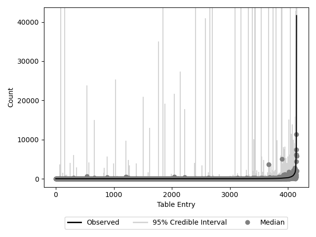

Diagnosing BIRDMAn models
=========================

One of the most important things to do when running BIRDMAn is to diagnose your model to make sure that it is useful for your downstream analysis. There are a lot of ways to do this and a ton of literature/tools about diagnosing Bayesian models.

BIRDMAn wraps many function present in the ``arviz`` package. We recommend reading through their documentation for more information. You can use the ``to_inference`` method in any BIRDMAn object to convert your model into a format that is compatible with ``arviz``. We wrap a few of these functions for common diagnostics.

Rhat
----

The ``Rhat`` (:math:`\hat{R}`) statistic is a measure of chain convergence in MCMC methods. In a nutshell this metric describes the concordance between within-chain and between-chain parameter estimates. If these values are very similar, ``Rhat`` will be close to 1. You should check the ``Rhat`` values of your model to ensure convergence.

.. code-block:: python

    from birdman.diagnostics import rhat
    rhat(inference)

PSIS-LOO-CV
-----------

Pareto-smoothed importance sampling leave-one-out cross-validation (PSIS-LOO-CV, referred to informally as LOO) estimates the (log) pointwise predictive density. This can be thought of as an estimation of traditional leave-one-out cross validation, which is often very computationally expensive for Bayesian models. To calculate this metric, one must generate posterior predictive values in the Stan code and specify this variable when calling ``to_inference``.

The expected log pointwise predictive density ``elpd`` is the sum of the posterior draws log likelihood values. The objective is to maximize this value (closer to 0). However, it is important to note that this is more useful as a relative measure. All other things being equal, a model with a higher ``elpd`` better predicts feature counts.

An important note here is the ability to calculate the *pointwise* predictive accuracy (at each data point). If you provide the ``pointwise=True`` option, you will also get the Pareto k diagnostic values. This metric assesses how well the PSIS-esimation converges. These values should be mostly less than 0.7. If you have many values above 0.7, it may indicate problems with the underlying model.

.. code-block:: python

    from birdman.diagnostics import loo
    loo(inference, pointwise=True)

Posterior predictive check
--------------------------

Posterior predictive checking (PPC) is the process of using the simulated posterior draws to predict the original values. If the model is fit well, you should be able to predict the counts in your table to a reasonable degree of accuracy. Note that for sequencing count data it is very difficult to predict values with small credible intervals. We recommend checking that the general shape of the predicted values matches the shape of the actual values.

We provide a function to plot posterior predictive checks if they have been calculated and included in the ``InferenceData`` object. This function returns a ``matplotlib`` figure where the black line represents the original values, the dark gray points represent the median predicted values across all chains and draws, and the light gray vertical lines represent the 95% credible interval of the value.

.. code-block:: python

    from birdman.visualization import plot_posterior_predictive_checks
    plot_posterior_predictive_checks(inference)

Comparing to null model
-----------------------

One way to determine whether or not your model is learning anything biologically useful is to compare to a "null" model (with no covariates). If you find that your model does not have more predictive power than random chance, it may be an indication that you should rethink your model construction.

This can be done fairly easily with ``arviz.compare``. This function takes as input a dictionary where the ``key: value`` pairs are the model name and the associated inference object respectively. The result will be a table of the models ranked in *decreasing* order of "goodness". Note that models must include ``log_likelihood`` groups for use in ``arviz.compare``.

.. code-block:: python

    import arviz as az
    # model_1 = InferenceData from model with covariates included
    # model_0 = InferenceData from model with formula = "1"
    az.compare({"null": model_0, "regression": model_1})
